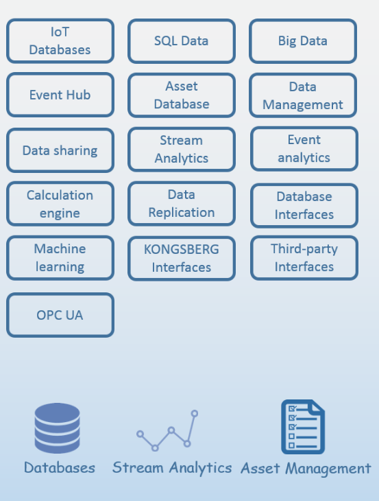
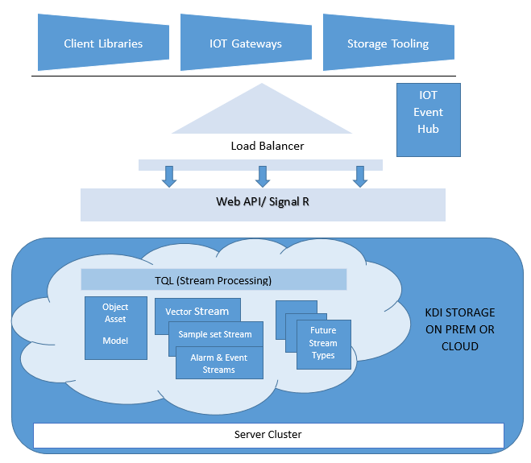

# Storage Documentation

Storage refers to a centralised repository for digital data that can be accessible by industrial users. It provides a common storage platform for Kongsberg products and solutions, as part of the kognifai platform by making data available for analytics, machine learning, and big data analysis across product lines.

The Kongsberg Digital Storage solution provides a database technology that is:

- Horizontaly scalable on load
- Cost efficient in small scale installations
- Cost efficient in large scale installations
- Utilize market-leading proven technologies
- Independent of business domain

# Major Technical components

Storage solutions consists of multiple components and technical solutions. Some of the major components are listed below:

- Time series / sensor database
- Asset database
- Event database
- Stream calculations
- Interfaces to support early adopters (including servers side support for application framework/GST, and staged selection among e.g. OPC DA, OPC UA, OPC AE, Web API, TQL)
- Management tools
- Calculation designer
- Cloud IoT gateway
 -Multitenant PaaS
- Storage Component

# Storage Architecture
The Kongsberg Digital Storage Solution architecture consists of Content Libraries, IOT Gateways, Storage Tooling, Load Balancer, and Web APIs to connect to the KDI Storage on PREM or Cloud. The KDI storage consists of stream processing of TQL (time Series Query Language) on server cluster. A high level architectural diagram of Storage solution is shown below:

# License
Read the copyright information and terms and conditions for Usage and Development of the software [here]( https://github.com/kognifai/Core_Documentation/blob/master/License.md).
